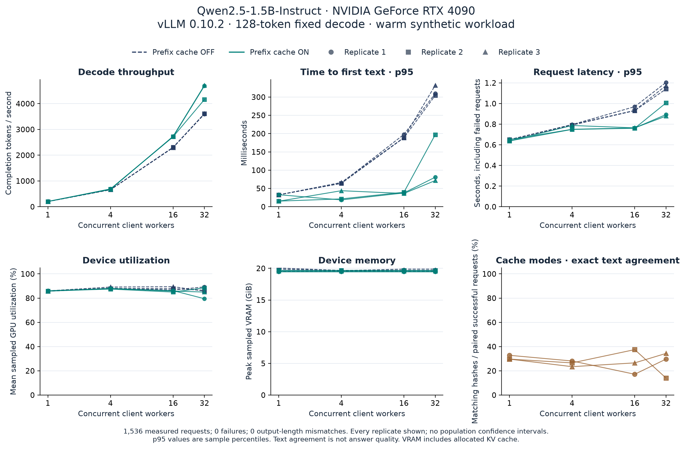

# Controlled GPU serving pilot: measured results

A single RTX 4090 completed **1,536 measured requests across 24 stages**, with **zero failed requests and zero deviations from the fixed 128-token output length**. At concurrency 32, observed throughput was **3,594–3,614 completion tokens/s with prefix caching OFF** and **4,160–4,712 tokens/s with it ON** across the three repeats. This is a small, warm synthetic serving experiment on one GPU.

**The two modes were not output-equivalent:** only **210 of 768 paired responses (27.34%)** had identical output-text hashes. Accordingly, these observations are not a lossless speedup claim, an answer-quality result, or evidence of universally faster serving. The cause of output differences was not diagnosed.

## Experiment and provenance

- Executed September 24, 2026, 02:23:42–02:34:00 UTC. The frozen runner took 617.9 seconds including six model startups; provisioning time is outside this interval.
- Evaluated source commit: `b37bda80e0904485a9e33918f374aa5d0c2f2b60`. The [protocol](../../docs/CONTROLLED_PILOT_V1.md) and [machine-readable plan](raw/protocol.json) were committed before execution.
- Model/tokenizer: `Qwen/Qwen2.5-1.5B-Instruct`, revision `989aa7980e4cf806f80c7fef2b1adb7bc71aa306`, Apache-2.0. BF16, one GPU, no speculative or quantization treatment.
- Actual GPU: NVIDIA GeForce RTX 4090, 24,564 MiB reported VRAM, driver `580.159.04`.
- vLLM `0.10.2`, PyTorch `2.8.0+cu128`, Transformers `4.56.1`, Python `3.12.11`.
- Pinned amd64 image: `vllm/vllm-openai@sha256:df2607b26bdda2875de4832f4d08da0055b4b6e3570347f3a849bcc652771dd6`.
- Three paired replicates; four concurrency levels; 64 measured requests and four logged warmups per stage. The same 64 synthetic prompts recur across stages, with matched shuffled order within each replicate. Actual prompt lengths were 132–1,058 tokens.
- Every response finished with `length`, as expected with fixed `min_tokens=max_tokens=128` and `ignore_eos=true`. Measured output volume was 196,608 tokens; 96 warmups bring the logged total to 208,896 tokens.
- Original raw files were copied byte-for-byte for publication. [Provenance and file hashes](provenance.json) identify the source archive and all copied files. The source archive and its original extraction were not modified by analysis.
- The GPU was terminated after artifact collection. A subsequent [provider billing record](billing.json) reports **$0.225616** for 1,088.584 billed seconds, consistent with the allocation interval. This is whole-pod API accounting, including setup and artifact collection, not an invoice or a steady-state serving price. The performance-only `raw/report.json` leaves its cost field null; billing is attached separately without changing original measurements.

## Observations

Each table value below is the arithmetic mean of the three stage-level observations, followed by the minimum–maximum across those three repeats. p95 values are individual 64-request sample percentiles; averaging them does not create a pooled p95 or a confidence interval.

| Workers | Prefix cache | Completion tokens/s, mean [range] | First-text p95, ms, mean [range] | Request p95, s, mean [range] |
|---:|:---:|---:|---:|---:|
| 1 | OFF | 202 [201–202] | 32.5 [32.5–32.6] | 0.650 [0.649–0.651] |
| 1 | ON | 203 [202–204] | 21.1 [15.1–32.9] | 0.642 [0.637–0.651] |
| 4 | OFF | 661 [661–662] | 64.9 [63.8–66.3] | 0.794 [0.791–0.796] |
| 4 | ON | 683 [673–691] | 28.0 [18.7–43.8] | 0.762 [0.750–0.787] |
| 16 | OFF | 2,301 [2,293–2,308] | 191.9 [188.6–197.9] | 0.945 [0.931–0.970] |
| 16 | ON | 2,722 [2,716–2,733] | 37.9 [36.3–39.7] | 0.763 [0.761–0.764] |
| 32 | OFF | 3,607 [3,594–3,614] | 315.5 [304.5–332.2] | 1.174 [1.141–1.205] |
| 32 | ON | 4,521 [4,160–4,712] | 116.6 [71.6–197.2] | 0.926 [0.878–1.006] |

At concurrency 1, throughput was similar across modes. The higher-concurrency cache-ON cells had higher observed throughput and generally shorter first-text delay, but the strength of the contrast depended on stage order and cache warming. Replicate 2 began at concurrency 32; its cache-ON p95 first-text time was 197.2 ms, compared with 80.9 and 71.6 ms when that stage came later in the other repeats. This is consistent with a warm-state/order limitation, not a separately isolated causal estimate.



[Vector SVG](figures/controlled-serving-pilot.svg) · [PDF figure](figures/controlled-serving-pilot.pdf) · [Figure provenance](figures/figure-manifest.json)

## Every measured replicate

All 64 requests in every row succeeded. GPU values use only samples inside that measured stage, excluding warmups and server startup. Device VRAM includes vLLM's allocated KV cache and other device allocations; it is not model-weight size or process-only peak memory.

| Replicate | Cache | Workers | Tokens/s | First-text p95 (ms) | Request p95 (s) | Mean GPU use (%) | Peak VRAM (MiB) | GPU samples |
|---:|:---:|---:|---:|---:|---:|---:|---:|---:|
| 1 | OFF | 1 | 202.4 | 32.6 | 0.649 | 85.90 | 20,010 | 81 |
| 1 | OFF | 4 | 660.7 | 64.6 | 0.796 | 88.21 | 20,010 | 24 |
| 1 | OFF | 16 | 2,301.8 | 197.9 | 0.970 | 86.71 | 20,010 | 7 |
| 1 | OFF | 32 | 3,594.4 | 309.7 | 1.205 | 89.25 | 20,010 | 4 |
| 1 | ON | 1 | 202.2 | 32.9 | 0.651 | 86.06 | 19,906 | 81 |
| 1 | ON | 4 | 690.6 | 18.7 | 0.750 | 87.83 | 19,906 | 24 |
| 1 | ON | 16 | 2,718.2 | 37.7 | 0.763 | 86.17 | 19,906 | 6 |
| 1 | ON | 32 | 4,691.6 | 80.9 | 0.894 | 79.50 | 19,906 | 4 |
| 2 | ON | 32 | 4,160.0 | 197.2 | 1.006 | 88.50 | 20,150 | 4 |
| 2 | ON | 16 | 2,715.5 | 39.7 | 0.761 | 85.00 | 20,150 | 6 |
| 2 | ON | 4 | 685.4 | 21.4 | 0.750 | 87.46 | 20,150 | 24 |
| 2 | ON | 1 | 203.3 | 15.4 | 0.638 | 85.86 | 20,150 | 81 |
| 2 | OFF | 32 | 3,614.0 | 304.5 | 1.141 | 86.40 | 20,146 | 5 |
| 2 | OFF | 16 | 2,308.4 | 188.6 | 0.931 | 87.86 | 20,146 | 7 |
| 2 | OFF | 4 | 662.5 | 63.8 | 0.791 | 87.88 | 20,146 | 25 |
| 2 | OFF | 1 | 201.1 | 32.5 | 0.651 | 85.69 | 20,537 | 81 |
| 3 | OFF | 4 | 660.8 | 66.3 | 0.796 | 89.12 | 20,110 | 25 |
| 3 | OFF | 32 | 3,613.7 | 332.2 | 1.175 | 85.80 | 20,356 | 5 |
| 3 | OFF | 1 | 201.5 | 32.5 | 0.651 | 85.96 | 20,356 | 81 |
| 3 | OFF | 16 | 2,292.6 | 189.3 | 0.933 | 89.43 | 20,356 | 7 |
| 3 | ON | 4 | 672.8 | 43.8 | 0.787 | 87.96 | 20,024 | 25 |
| 3 | ON | 32 | 4,712.0 | 71.6 | 0.878 | 85.00 | 20,024 | 3 |
| 3 | ON | 1 | 204.0 | 15.1 | 0.637 | 85.74 | 20,024 | 81 |
| 3 | ON | 16 | 2,732.7 | 36.3 | 0.764 | 85.83 | 20,024 | 6 |

The 24 measured intervals contain **697 direct NVIDIA-smi samples**. Individual stages contain only 3–81 samples at the 500 ms cadence. Mean sampled GPU utilization ranged from 79.50% to 89.43%; maximum observed device VRAM was 20,537 MiB. Short high-concurrency stages do not provide enough GPU samples to characterize stable utilization or instantaneous memory peaks. Compute-process snapshots show no active compute process before the experiment and the vLLM engine during serving; namespace and provider-isolation limits still prevent proving that no external interference was possible.

## Output agreement is a separate result

| Workers | Replicate 1: exact matches / 64 | Replicate 2: exact matches / 64 | Replicate 3: exact matches / 64 |
|---:|---:|---:|---:|
| 1 | 21 | 19 | 19 |
| 4 | 18 | 17 | 15 |
| 16 | 11 | 24 | 17 |
| 32 | 19 | 9 | 22 |

Equal output lengths control decode volume, but they do not guarantee equal text. Temperature zero is not sufficient evidence of deterministic, identical output across changed execution settings. The stored text hashes prove the mismatches; this experiment does not determine whether they change answer quality. No semantic judge, accuracy metric, output-equivalence claim or lossless label is added.

## Integrity and limitations

The analysis independently recomputed every stage summary from raw request records. It found no missing stages, duplicate request IDs, unexpected response model IDs, output-length mismatches, missing measured-interval telemetry or protocol inconsistencies. The [structured report](raw/report.json) and [stage CSV](raw/stages.csv) preserve the full precision and source file hashes.

This pilot covers one GPU, one small model and synthetic repeated prompts. Sixty-four requests per stage and three repeats yield descriptive observations, not production-tail guarantees, hardware-general conclusions or robust population confidence intervals. Cache state persists between warmed stages, and the three pairing directions cannot completely counterbalance temporal drift. The fixed-output workload intentionally forces generation to 128 tokens. No natural-response quality, quantization, speculative-decoding comparison or multi-GPU result was measured.

Client TTFT is time to the first nonempty text chunk, including scheduling and local transport; inter-chunk gaps are not an engine-level token trace. GPU sampling is device-wide. Server log timestamps use the container's local clock, while client timestamps and GPU CSV timestamps are UTC; telemetry joins use the latter two explicit UTC sources. The separate provider billing receipt covers the entire allocation and is not used to invent stage-specific billed costs or production dollar-efficiency claims.

## Reproduce the analysis

No GPU or API key is needed to recompute these artifacts:

```bash
python -m inference_lab.pilot_report artifacts/controlled-pilot-v1/raw
python -m pip install -r requirements-analysis.txt
python -m inference_lab.pilot_plots artifacts/controlled-pilot-v1/raw \
  --output artifacts/controlled-pilot-v1/figures
```

The commands rebuild derived files from the committed raw copy. A fresh inference run is a different paid experiment and must retain its own complete artifacts. Historical Colab results are neither overwritten nor pooled with this pilot.
