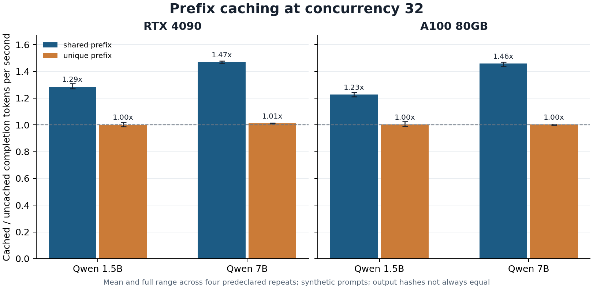

# Factorial serving extension: verified measurements

**Run completed:** September 25, 2026 UTC. This is a separate, prospective extension of the [original controlled pilot](../controlled-pilot-v1/RESULTS.md). The [protocol](../../docs/FACTORIAL_SERVING_V1.md) and [freeze](../../protocols/factorial-serving-v1-freeze.json) preceded both GPU allocations; frozen source commit `ff3cff9ee458091ef7c6e96494131d9de27f2eeb`, protocol SHA-256 `a020a05f5f01c9d480116102497801cc26122f6fcafed7dbcd214755664fbee8`.

Two pinned Qwen2.5-Instruct checkpoints (1.5B and 7B) were served using vLLM 0.10.2 on one RTX 4090 and one A100-SXM4-80GB. For each GPU, the fixed matrix had two model sizes, shared or unique prefixes, cache off or on, four predeclared repeats, and concurrency 1/4/16/32. Every stage had 64 measured synthetic requests targeting 128 output tokens. Models were restarted for each model/prefix/repeat/cache cell; workload IDs and prompt order were paired across cache modes and hardware. The order was counterbalanced as specified in the freeze.

All **16,384/16,384 measured requests** completed at the HTTP level: 8,192 per GPU, 128 stage summaries and 128 before/after metric pairs per GPU. The recovered archives matched the controller's SHA-256 checksums, embedded freezes matched the source freeze semantically, and the provider returned **zero remaining pods** after both terminations. The [machine-readable cell data](cells.csv), [four-repeat aggregates](aggregates.csv), [exact-output hash counts](comparisons.json), and [review summary](summary.json) contain no prompts, generated text, personal data or credentials. Raw archives remain in private project storage pending any separate publication review.



At concurrency 32, cached/uncached completion-token throughput ratios were:

| GPU | Model | Shared prefix, mean (range) | Unique prefix, mean (range) |
|---|---|---:|---:|
| RTX 4090 | Qwen 1.5B | 1.285x (1.272–1.308) | 1.002x (0.988–1.020) |
| RTX 4090 | Qwen 7B | 1.470x (1.458–1.478) | 1.010x (1.008–1.014) |
| A100 80GB | Qwen 1.5B | 1.227x (1.211–1.245) | 1.003x (0.990–1.026) |
| A100 80GB | Qwen 7B | 1.459x (1.436–1.469) | 1.004x (0.997–1.007) |

These are four-repeat descriptive means and full ranges of matched cache-on/cache-off ratios, **not** population confidence intervals. Under this synthetic workload, shared prefixes coincided with higher measured throughput at high concurrency; unique prefixes did not show the same change. For shared prefixes at concurrency 32, mean cache-on/cache-off ratios of stage p95 time to first text chunk were 0.19–0.28 across the four GPU/model combinations. For unique prefixes they were approximately 0.96–1.05. See `cells.csv` for the underlying stage p95 latency, time to first text chunk, and throughput values.

**Output parity fails.** With cache off/on paired by workload ID on the RTX 4090, exact output hashes matched in 1,665/2,048 requests for 1.5B and 1,001/2,048 for 7B. On A100 the corresponding counts were 1,635/2,048 and 1,077/2,048. Across hardware, hashes matched in 3,246/4,096 requests for 1.5B and 2,027/4,096 for 7B. HTTP success is therefore not answer quality, and the throughput ratios are **not lossless speedups**. No semantic quality comparison was performed.

The two pods were terminated and a fresh provider pod listing contained zero pods. The recorded allocation-lifetime × quoted-hourly-rate estimate is **$1.30 RTX 4090 + $2.15 A100 = $3.45**, below the approved $18 campaign cap. This is **not a provider invoice**: the scoped API key cannot read Runpod billing (HTTP 403), so exact billed cost remains unverified and is `null` in `summary.json`. No budget increase, replacement pod, or selective rerun was made.

Interpretation is limited to one allocated machine of each GPU type, one model family, fixed-length synthetic text, four repeated workloads, the exact pinned versions, and this serving configuration. Absolute KV-cache capacity differs across the two cards even at the same memory fraction. The measured first-chunk time is not token-level TTFT telemetry. This experiment does not evaluate answer correctness, production traffic, speculative decoding, quantization, or general hardware superiority.

To regenerate the derived tables from the two private `output.tar.gz` archives and matching lease/execution files, run:

```bash
python3 scripts/analyze_factorial_serving.py \
  --evidence-dir /path/to/private-evidence \
  --output-dir artifacts/factorial-serving-v1

# Optional figure; requires matplotlib.
python3 scripts/plot_factorial_serving.py \
  --cells artifacts/factorial-serving-v1/cells.csv \
  --output artifacts/factorial-serving-v1/cache-throughput-c32.png
```

The analyzer verifies archive hashes, the frozen cell set, all 256 stage summaries, 16,384 request records, telemetry-file presence, and termination receipts before writing public aggregates.
